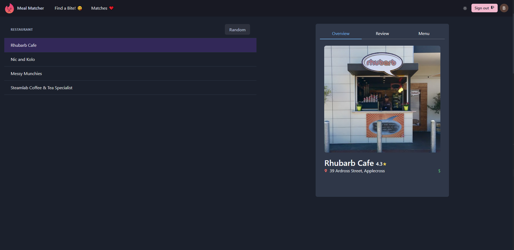

# Meal Matchers 
Its like *Tinder* but for restaurant and you always get a match 😋. This project idea stems from my inability to decide where to eat and love for exploring new restaurants.

This project uses `React` as the frontend, `Express` as the backend, `Firestore` as the database and `Firebase` for user authentication. It also uses Google's Places API to get nearby restaurants. 

# Demo
A demo of this project can be found [here](https://drive.google.com/file/d/1cAlvxHhAGJXi15AjkgUKm8tW-myaw2sI/view?usp=sharing)

# Description
After the users login with their gmail accounts they will be greeted by the main page where they can swipe away! Similar to Tinder, if they are interested in the restaurant, they can swipe right which will save the restaurant id to their firestore document.

 

Each card has information such as rating, price category, address, open status and reviews if they exist. There will be future implementation to display restaurants Uber Eat's menu using UE's menu API. 

 

There is a page where users can view thier matches and decide a restaurant they want to eat at or use the 'random' button to pick for them. 

 

# How to run
1. Generate a [Google API key](https://support.google.com/googleapi/answer/6158862?hl=en) with Google Places API enabled and a billing account linked. 
2. Go to `./frontend/.env` & `./backend/.env` and replace `YOUR_KEY` with the key you generated. 
3. We can either boot it with Docker or normally with the following commands.
    ### Docker
    > docker-up compose
    ### Without Docker
    > npm start

> Note that it does cost money to call Google Places API after a certain limit and there's a $200 Google monthly credit for Google Map related APIs so if you are just planning to play around it for a little bit should be fine.
# What I have learnt
- Chraka-ui 💖, awesome React UI library that is aesthetically pleasing & easy to use.
- Firestore & Firebase, simple to use google authenication and noSQL data. Also learnt how to model data. Technology choices are partly inspired by this [video](https://www.youtube.com/watch?v=zQyrwxMPm88)
- Better understanding of `aync` / `await` and how to handle a loop that returns promises.
- Using `concurrently` to run subfolder services in 1 command
- Google API calls can get expensive if you are not careful while developing 😭
